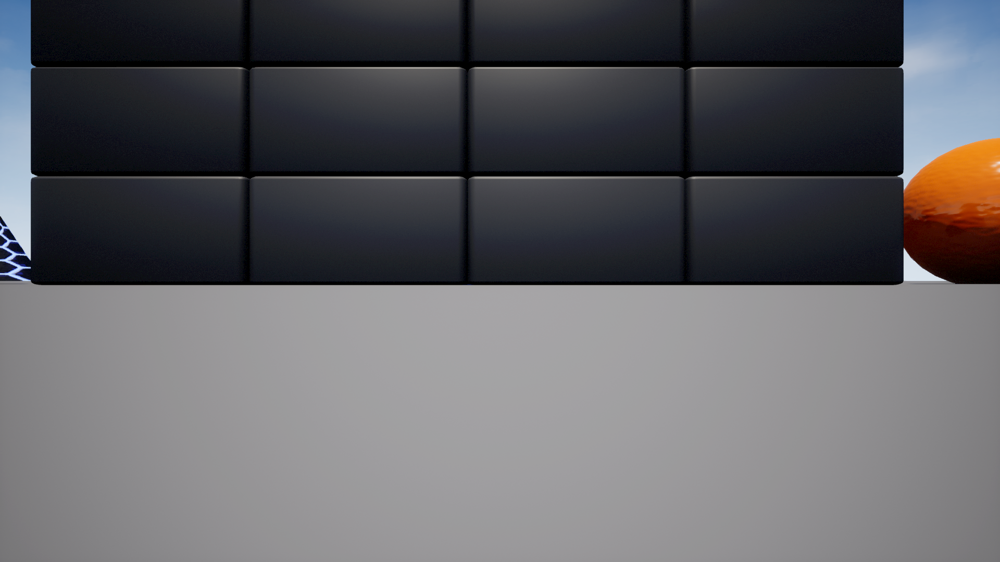
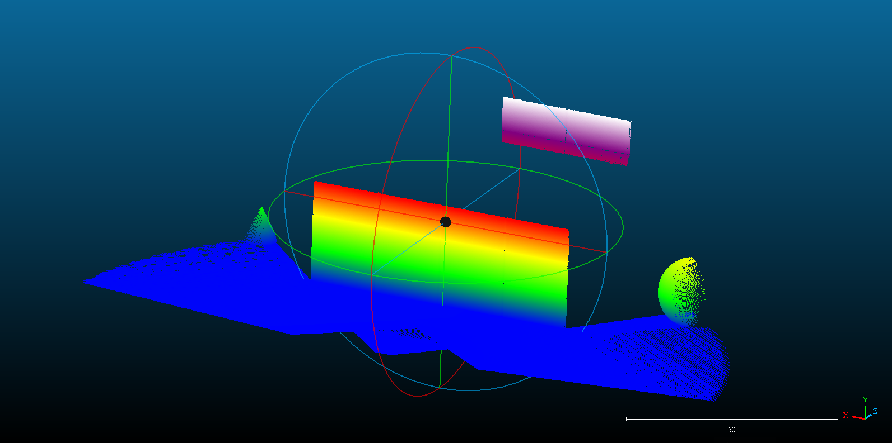
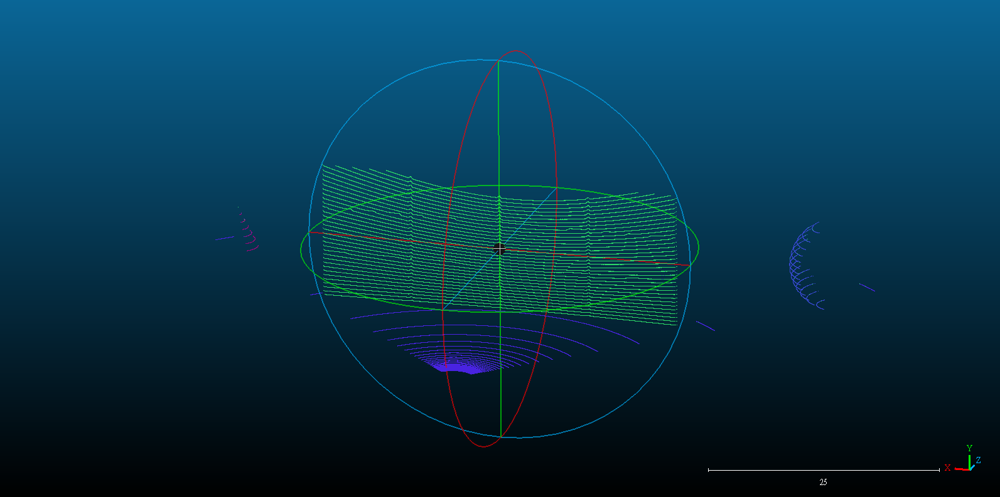

# Airsim Depth to Point Cloud
## Directions
This tool is used to conduct experiments by converting depth maps into point cloud data.

## Usage

### Requirement

* Unreal Engine 5
* AirSim Plugin

### Environment

* Python 3.9
* numpy 1.21.6
* AirSim API : Please read this [page](https://microsoft.github.io/AirSim) to install AirSim API.
* wheel 0.42.0
* keyboard
* opencv-python

### Installation

* Clone this repo:
```
git clone https://github.com/Kura0913/AirSim-Depth-to-PointCloud.git
```

* file tree:
```
AirSim-Depth-to-PointCloud
│  settings.json
│  
├─client
│  │  main_client.py
│  │  
│  ├─ClientCommand
│  │      GetCameraInfo.py
│  │      SavePointCloud.py
│  │      
│  └─SocketClient
│          SocketClient.py
│          
└─server
    │  main_server.py
    │  
    ├─DBController
    │      CameraInfoTable.py
    │      ColorInfoTable.py
    │      DBConnection.py
    │      DBInitializer.py
    │      DroneInfoTable.py
    │      PointCloudInfoTable.py
    │      
    ├─ServerCommand
    │      GetCameraInfo.py
    │      SavePointCloud.py
    │      
    ├─SocketServer
    │      JobDispatcher.py
    │      SocketServer.py
    │      
    └─Tools
            AirsimTools.py
            PointCloud.py
```
### settings.json
The following is the JSON configuration file for the AirSim plugin. 

In the "CaptureSettings" of the camera object named "drone_1," the "Width" and "Height" represent the dimensions of the captured depth image.

You can adjust the name of the vehicle according to your preference, and the size of the captured images can be adjusted according to the performance of the computer.

**Please do not change the names of cameras and lidars. The API will retrieve an image or point cloud based on the name of the camera or lidar.**

```
{
  "SettingsVersion": 1.2,
  "SimMode": "Multirotor",
  "LogMessagesVisible": false,
  "CameraDefaults": {
    "CaptureSettings": [
      {
        "ImageType": 0,
        "Width": 1920,
        "Height": 1080,
        "FOV_Degrees": 90,
        "AutoExposureSpeed": 100,
        "AutoExposureBias": 0,
        "AutoExposureMaxBrightness": 0.64,
        "AutoExposureMinBrightness": 0.03,
        "MotionBlurAmount": 0,
        "TargetGamma": 1.0,
        "ProjectionMode": "",
        "OrthoWidth": 5.12
      },
      {
        "ImageType": 1,
        "Width": 1920,
        "Height": 1080,
        "FOV_Degrees": 90
      },
      {
        "ImageType": 2,
        "Width": 1920,
        "Height": 1080,
        "FOV_Degrees": 90
      },
      {
        "ImageType": 3,
        "Width": 1920,
        "Height": 1080,
        "FOV_Degrees": 90
      },
      {
        "ImageType": 5,
        "Width": 1920,
        "Height": 1080,
        "FOV_Degrees": 90
      }
    ]
  },
  "Vehicles": {
    "drone_1": {
      "VehicleType": "SimpleFlight",
      "AutoCreate": true,
      "AllowAPIAlways": true,
      "EnableTrace": false,
      "Cameras": {
        "front_camera": {
          "CaptureSettings": [
            {
              "ImageType": 0,
              "Width": 960,
              "Height": 540,
              "FOV_Degrees": 90
            },
            {
              "ImageType": 1,
              "Width": 960,
              "Height": 540,
              "FOV_Degrees": 90
            },
            {
              "ImageType": 2,
              "Width": 960,
              "Height": 540,
              "FOV_Degrees": 90
            },
            {
              "ImageType": 5,
              "Width": 960,
              "Height": 540,
              "FOV_Degrees": 90
            }],
            "X": 0.0,
            "Y": 0.0,
            "Z": -0.5,
            "Pitch": 0.0,
            "Roll": 0.0,
            "Yaw": 0.0
        }
      },
      "Sensors":{
        "front_lidar": {
          "SensorType": 6,
          "Enabled" : true,
          "NumberOfChannels": 64,
          "RotationsPerSecond": 10,
          "PointsPerSecond": 1500000,
          "X": 0, "Y": 0, "Z": -1,
          "Roll": 0, "Pitch": 0, "Yaw" : 0,
          "VerticalFOVUpper": 26.8,
          "VerticalFOVLower": -26.8,
          "HorizontalFOVStart": -45,
          "HorizontalFOVEnd": 45,
          "DrawDebugPoints": true,
          "DataFrame": "SensorLocalFrame"
        }
      }
    }
  },
  "PawnPaths": {
    "BareboneCar": {
      "PawnBP": "Class'/AirSim/VehicleAdv/Vehicle/VehicleAdvPawn.VehicleAdvPawn_C'"
    },
    "DefaultCar": {
      "PawnBP": "Class'/AirSim/VehicleAdv/SUV/SuvCarPawn.SuvCarPawn_C'"
    },
    "DefaultQuadrotor": {
      "PawnBP": "Class'/AirSim/Blueprints/BP_FlyingPawn.BP_FlyingPawn_C'"
    },
    "DefaultComputerVision": {
      "PawnBP": "Class'/AirSim/Blueprints/BP_ComputerVisionPawn.BP_ComputerVisionPawn_C'"
    }
  }
}

```

### server

Run main_server.py to start the server. When the server starts, it will output its IP address, which can be used for client connection settings.

### client

Before starting, please open the simulation environment in Unreal Engine. 

Then, run main_client.py to start the client. Upon starting, input the server's IP address to establish a connection with the server. 

**(Please note that if the server is running on another computer, ensure that both computers are connected to the same Wi-Fi)**

Next, input the information of the drone and the image size according to the settings in settings.json.

#### start get data
Enter the command on the client and it will start to obtain the data.

| **command** | **directions**                                                                                                  |
|:-----------:|:----------------------------------------------------------------------------------------------------------------|
| gen-depth   | Start capturing depth maps and sending them to the server. Press the "p" key to stop capturing.                 |
| gen-lidar   | Start save point cloud infomation of lidar and sending them to the server. Press the "p" key to stop capturing. |
| exit        | Close client.                                                                                                   |


### tool package
| **file name**                    | **directions**                                                                                                                                                  |
|:--------------------------------:|:---------------------------------------------------------------------------------------------------------------------------------------------------------------|
| airsim_drone_keyboard_control.py | Execute this file to control the drone directly through the keyboard                                                                                            |
| point_cloud_to_asc.py            | After generating point cloud data, you can execute this file to convert the data in the DB to an asc file, and apply color gradient changes based on height.    |
| point_cloud_to_asc_with_color.py | After generating point cloud data, you can execute this file to convert the data in the DB into an asc file, and assign colors based on the RGB data in the DB. |

## Demo
|scene|gen-depth|
|:-------------------------------:|:-------------------------------:|
|||


|segmentation|gen-lidar|
|:-------------------------------:|:-------------------------------:|
|||
